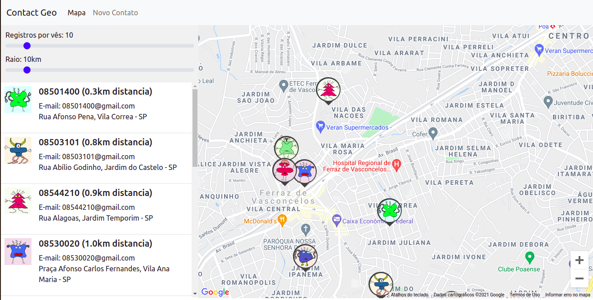
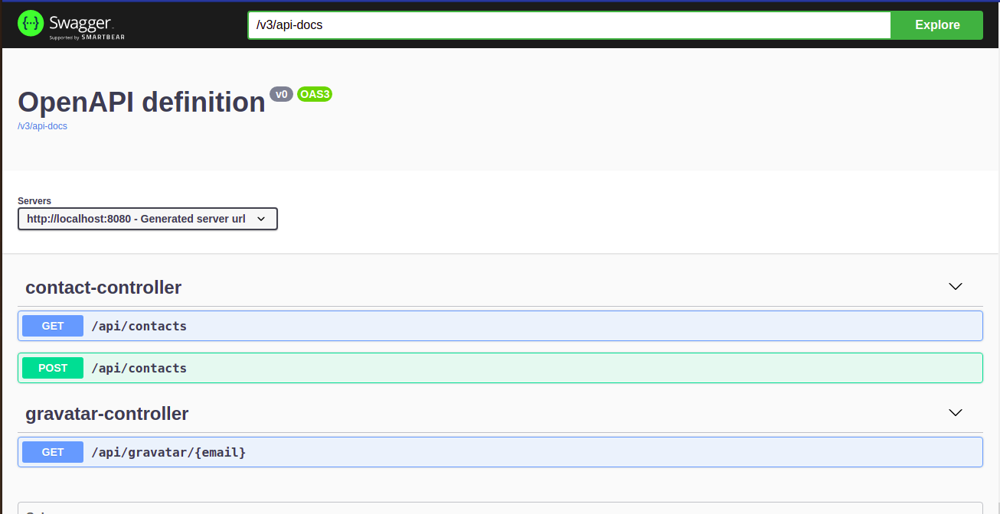

# Contatos por GEO

A ideia desse projeto era colocar em pratica tudo que foi estudado nos cursos meio que um desafio para consolidar o aprendizado.

## Setup

1. Copie o `/backend/api/.env.example` para `/backend/api/_env` e substitua as configurações necessárias.

2. Tenha docker + docker-compose instalado
`
docker-compose up --build -d
`

### Serviços

- http://localhost:8089/ (frontend)

- http://localhost:8080/api/doc (backend)

- localhost:27017 (mongodb)

## Backend

### Integração

- Google Maps API (Para pegar a geo)
- Busca CEP (para completar o endereço)
- Gravatar (para buscar uma imagem de perfil com base no email)

### Estrutura de Arquivos dentro do framework

- controller
- resource
- dto
- entity
- repository
- service
- exception

### Recursos/Ferramentas

- MongoDB
- SpringBoot
- Kafka (V2)
- Redis (V2)